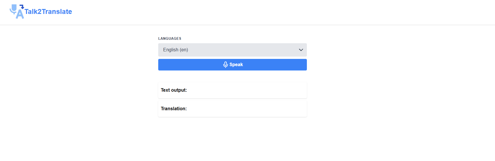

# Talk2Translate

Talk2Translate is a voice translation app I developed to explore real-time translation and voice input integration. It uses SpeechRecognition to capture spoken input and OpenAI’s API to provide text translation, allowing for smooth and interactive user experiences.

Key Learnings:

- Integrating SpeechRecognition for voice input, enhancing user interaction through speech-to-text conversion.
- Utilizing OpenAI API for text translation, focusing on API integration and dynamic data handling.
- Developing responsive, modern UIs with Tailwind CSS for intuitive design.
- Leveraging Next.js for server-side rendering and performance optimization.
- Strengthening my skills in TypeScript for type safety and managing complex application states.
- Through this project, I gained hands-on experience with speech recognition, real-time translation, and frontend development, pushing my understanding of building scalable, accessible web applications.



## TechStack

- Nextjs
- Typescript
- Tailwind CSS
- OpenAI API

## Key Features

- Hero
- About Section
- Skill Section
- Project Section
- Footer

## Prerequisites

- Node.js
- npm or yarn or pnpm or bun for package management

## Installation

1. Clone the repository

```bash
[https://github.com/vjvic/victor-portfolio.git](https://github.com/vjvic/talk2translate.git)

```

2.  Navigate to project directory

```bash
cd talk2translate

```

3. Install the dependencies:

```bash
npm install

```

## Usage

1. Start the development server

```bash
npm run dev

```

2. Access the application in your browser at http://localhost:3000.
